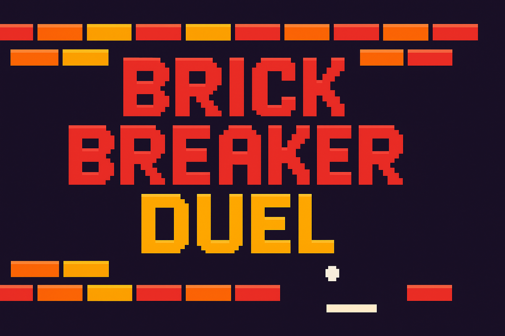
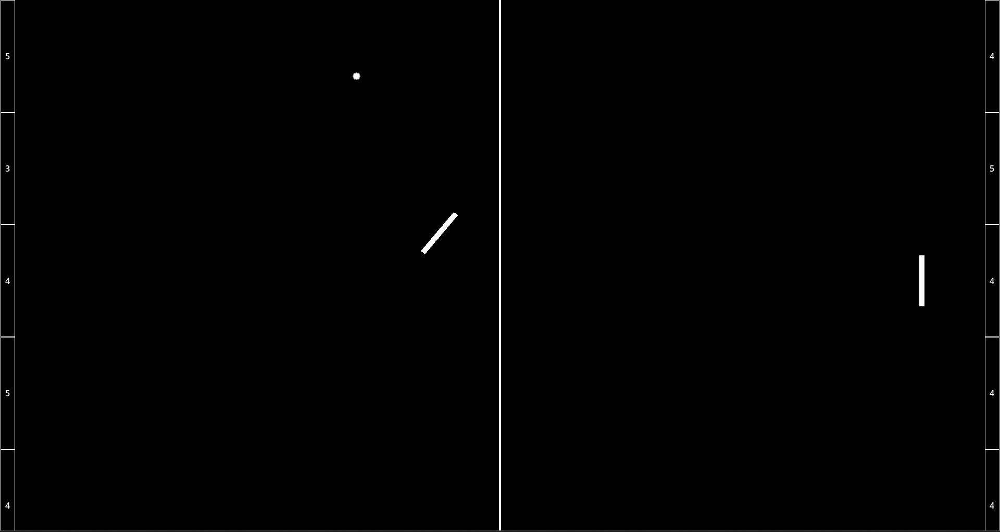

<p align="center">
  
</p>

# 🎮 Brick Breaker Duel

**Brick Breaker Duel** is a modern arcade twist on *Pong* and *Breakout*.  
Two players face off in a fast-paced duel: defend your destructible wall while trying to smash a hole into your opponent’s. The first to break through wins!  
It’s all about **tactics, skill, and reaction time**.

---

## ✨ Features
- 🏓 Two-player competitive gameplay  
- 🧱 Destructible walls as your defense  
- 🔄 Free movement & rotatable paddles for skill shots  
- ⚡ Fast-paced matches with tactical depth  

---

## 🕹️ How to Play
1. Each player controls a paddle on their half of the arena.  
2. Defend your wall from the incoming ball.  
3. Aim carefully: break the opponent’s wall by hitting the ball through it.  
4. First to punch a hole wins the duel!  

---

## 🎮 Controls

### Keyboard
| Action            | Player 1   | Player 2   |
|-------------------|------------|------------|
| Move              | `WASD`     | Arrow keys |
| Rotate Paddle     | `Q` / `E`  | `,` / `.`  |
| Reset Rotation    | `Space`    | `Enter` (example – adjust if different) |

### Gamepad
| Action            | Both Players |
|-------------------|--------------|
| Move              | Left Stick   |
| Rotate Paddle     | `L2` / `R2`  |
| Reset Rotation    | `X`          |

---

## 🚀 Getting Started
### Run from source
1. Clone the repository:
   ```bash
   git clone https://github.com/Zablo13/brick-breaker-duel.git
   cd brick-breaker-duel
Open the project in Godot Engine (vX.X or later).

Press ▶️ to start the game.

Pre-built (if you add binaries later)
Download the latest release from the Releases page.

📸 Screenshots
Gameplay
<p align="center">   </p>
🔊 Sound
This game uses sounds from the "Pong softsynth" pack on Freesound.

The pack contains sounds by the following user:

NoiseCollector – profile

You can find the pack online here:
👉 https://freesound.org/people/NoiseCollector/packs/254/

🛠️ Tech Stack
Godot Engine

GDScript

🤝 Contributing
Got ideas for improvements? Feel free to fork, open issues, or submit pull requests.

📜 License
This project is licensed under the
GNU General Public License v3.0 © 2025 Zablo13